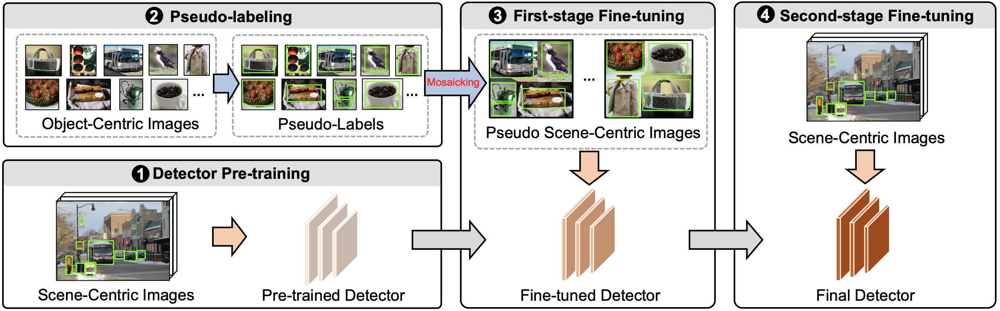

# MosaicOS
**Mosaic** of **O**bject-centric Images as **S**cene-centric Images (**MosaicOS**) for long-tailed object detection and instance segmentation.



## Introduction
Many objects do not appear frequently enough in complex scenes (e.g., certain handbags in living rooms) for 
training an accurate object detector, but are often found frequently by themselves (e.g., in product images). 
Yet, these object-centric images are not effectively leveraged for improving object detection in scene-centric 
images. 

We propose Mosaic of Object-centric images as Scene-centric images (MosaicOS), a simple and novel framework that is surprisingly effective at tackling the challenges of long-tailed object detection. Keys to our approach
are three-fold: (i) pseudo scene-centric image construction from object-centric images for mitigating domain differences, (ii) high-quality bounding box imputation using
the object-centric images’ class labels, and (iii) a multistage training procedure. Check our paper for further details:

[MosaicOS: 
A Simple and Effective Use of Object-Centric Images for Long-Tailed Object Detection](https://arxiv.org/abs/2102.08884). In IEEE/CVF International Conference on Computer Vision (ICCV), 2021.

by [Cheng Zhang*](https://czhang0528.github.io/), [Tai-Yu Pan*](https://scholar.google.com/citations?user=c67q8toAAAAJ&hl=en), 
[Yandong Li](https://cold-winter.github.io/), [Hexiang Hu](http://www.hexianghu.com/), [Dong Xuan](https://web.cse.ohio-state.edu/~xuan.3/), 
[Soravit Changpinyo](http://www-scf.usc.edu/~schangpi/), [Boqing Gong](http://boqinggong.info/), [Wei-Lun Chao](https://sites.google.com/view/wei-lun-harry-chao). 


## Pre-trained models

Our impelementation is based on [Detectron2](https://github.com/facebookresearch/detectron2).
All models are trained on [LVIS](https://www.lvisdataset.org/) training set with [Repeated Factor 
Sampling (RFS)](https://arxiv.org/abs/1908.03195). 

### LVIS v0.5 validation set
* Object detection

| Backbone | Method | APb | APbr | APbc | APbf | Download |
| :----: | :----: | :----:|:----: |:----: |:----: |:----: |
|[R50-FPN]() | Faster R-CNN | 23.4 | 13.0 | 22.6 | 28.4 | [model](https://buckeyemailosu-my.sharepoint.com/:u:/g/personal/pan_667_buckeyemail_osu_edu/ES8mmUMhyJ9GkNeDIwNhvB0BV5PYjWIfhtNE06ttws_gog?e=0CHcAO)  |
|[R50-FPN]() | MosaicOS | 25.0 | 20.2 | 23.9 | 28.3 | [model](https://buckeyemailosu-my.sharepoint.com/:u:/g/personal/pan_667_buckeyemail_osu_edu/ERJE9Kh-gBhLhqysyqZbcyQBP9RjPo_oe_gtm8jI5OP8Eg?e=9XP6kH)  |

* Instance segmentation

|Backbone| Method | AP | APr | APc | APf | APb | Download |
| :----:| :----: | :----: |:----: |:----: |:----: |:----: |:----: |
|[R50-FPN](https://github.com/facebookresearch/detectron2/blob/master/configs/LVISv0.5-InstanceSegmentation/mask_rcnn_R_50_FPN_1x.yaml) |Mask R-CNN| 24.4 | 16.0 | 24.0 | 28.3 | 23.6 | [model](https://dl.fbaipublicfiles.com/detectron2/LVISv0.5-InstanceSegmentation/mask_rcnn_R_50_FPN_1x/144219072/model_final_571f7c.pkl)  |
|[R50-FPN](https://github.com/facebookresearch/detectron2/blob/master/configs/LVISv0.5-InstanceSegmentation/mask_rcnn_R_50_FPN_1x.yaml) | MosaicOS | 26.3 | 19.7 | 26.6 | 28.5 | 25.8 | [model](https://buckeyemailosu-my.sharepoint.com/:u:/g/personal/pan_667_buckeyemail_osu_edu/ES5orlT__VlLk1DUdH6K2dABmJF4jIo25b2AbommVTiHrw?e=GexjL5)  |


### LVIS v1.0 validation set

* Object detection

| Backbone | Method | APb | APbr | APbc | APbf | Download |
| :----: | :----: | :----:|:----: |:----: |:----: |:----: |
|[R50-FPN]() | Faster R-CNN | 22.0 | 10.6 | 20.1 | 29.2 | [model](https://buckeyemailosu-my.sharepoint.com/:u:/g/personal/pan_667_buckeyemail_osu_edu/EYQAaDzq5PxNrdN5mvNXIowB-WGFKKtN8LD5mTHn1mxFCg?e=MpozsL)  |
|[R50-FPN]() | MosaicOS | 23.9 | 15.5 | 22.4 | 29.3 | [model](https://buckeyemailosu-my.sharepoint.com/:u:/g/personal/pan_667_buckeyemail_osu_edu/EVbkrKCwxhxJnZYqti2kv9MBl_Mw1FdkiUNlipWCABxOAg?e=DVyDrs)  |

* Instance segmentation

|Backbone| Method | AP | APr | APc | APf | APb | Download |
| :----:| :----: | :----: |:----: |:----: |:----: |:----: |:----: |
|[R50-FPN](https://github.com/facebookresearch/detectron2/blob/master/configs/LVISv1-InstanceSegmentation/mask_rcnn_R_50_FPN_1x.yaml) |Mask R-CNN| 22.6 | 12.3 | 21.3 | 28.6 | 23.3 | [model](https://buckeyemailosu-my.sharepoint.com/:u:/g/personal/pan_667_buckeyemail_osu_edu/EUC2q_cquVxOuTbT0Jhs_jsBI-KWqZBzH65xc7O8TDq0bA?e=7bZudB)  |
|[R50-FPN](https://github.com/facebookresearch/detectron2/blob/master/configs/LVISv1-InstanceSegmentation/mask_rcnn_R_50_FPN_1x.yaml) | MosaicOS | 24.5 | 18.2 | 23.0 | 28.8 | 25.1 | [model](https://buckeyemailosu-my.sharepoint.com/:u:/g/personal/pan_667_buckeyemail_osu_edu/Ebgvod--mcNCtlJd-Zx2fgIBK9DPY0ljV8KAzDGoY0fKCg?e=dePYhu)  |
|[R101-FPN](https://github.com/facebookresearch/detectron2/blob/master/configs/LVISv1-InstanceSegmentation/mask_rcnn_R_101_FPN_1x.yaml) |Mask R-CNN| 24.8 | 15.2 | 23.7 | 30.3 | 25.5 | [model](https://buckeyemailosu-my.sharepoint.com/:u:/g/personal/pan_667_buckeyemail_osu_edu/EcxslJyXWLRFosAWNPVhNnoBI8-A26VwcIlz9g9_LJLPrQ?e=eq9ph1)  |
|[R101-FPN](https://github.com/facebookresearch/detectron2/blob/master/configs/LVISv1-InstanceSegmentation/mask_rcnn_R_101_FPN_1x.yaml) | MosaicOS | 26.7 | 20.5 | 25.8 | 30.5 | 27.4 | [model](https://buckeyemailosu-my.sharepoint.com/:u:/g/personal/pan_667_buckeyemail_osu_edu/ESgvEq70ZcBMpGmxh8dNkzABXdNrubZ4vgLJcAeyNrcFag?e=xpSxYh)  |
|[X101-FPN](https://github.com/facebookresearch/detectron2/blob/master/configs/LVISv1-InstanceSegmentation/mask_rcnn_X_101_32x8d_FPN_1x.yaml) |Mask R-CNN| 26.7 | 17.6 | 25.6 | 31.9 | 27.4 | [model](https://buckeyemailosu-my.sharepoint.com/:u:/g/personal/pan_667_buckeyemail_osu_edu/EbpyIygM7xxMmx3yGsuaGAEBRGnlf4uDim1LmtepiVC_8g?e=M06hb3)  |
|[X101-FPN](https://github.com/facebookresearch/detectron2/blob/master/configs/LVISv1-InstanceSegmentation/mask_rcnn_X_101_32x8d_FPN_1x.yaml) | MosaicOS | 28.3 | 21.8 | 27.2 | 32.4 | 28.9 | [model](https://buckeyemailosu-my.sharepoint.com/:u:/g/personal/pan_667_buckeyemail_osu_edu/EdnZuTTz-BxGn5ZmaXD_5mYB5kfR_VEoQnUr7Sia0G8HqA?e=5povyB)  |

## Citation
Please cite with the following bibtex if you find it useful.
```
@inproceedings{zhang2021mosaicos,
  title={{MosaicOS}: A Simple and Effective Use of Object-Centric Images for Long-Tailed Object Detection},
  author={Zhang, Cheng and Pan, Tai-Yu and Li, Yandong and Hu, Hexiang and Xuan, Dong and Changpinyo, Soravit and Gong, Boqing and Chao, Wei-Lun},
  booktitle = {ICCV},
  year={2021}
}
```

## Questions
Feel free to email us if you have any questions.

Cheng Zhang (zhang.7804@osu.edu), Tai-Yu Pan (pan.667@osu.edu), Wei-Lun Harry Chao (chao.209@osu.edu)
